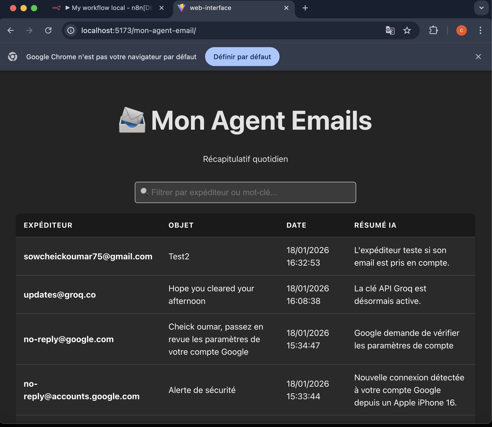
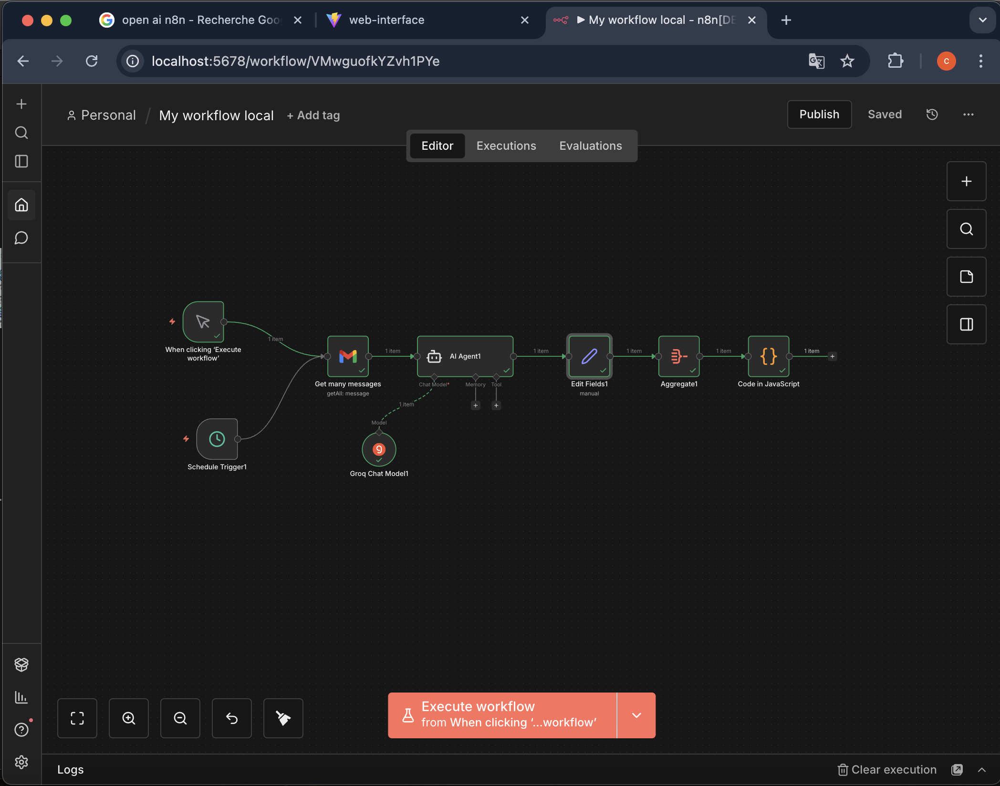

# 📨 Mon Agent Email Intelligent (AI-Powered Daily Digest)


Ce projet est une application complète "Local-First" qui automatise la lecture de mes emails, utilise l'Intelligence Artificielle pour les résumer, et affiche le résultat sur un tableau de bord web mis à jour quotidiennement.

---

## 📸 Aperçu du Résultat


> *L'interface React affichant les emails filtrés et résumés par l'IA.*

---

## 🏗 Architecture & Logique

Pour garantir la confidentialité des données et l'indépendance, nous avons une architecture **100% Locale**.

1.  📧 **Source :** API Gmail (Récupération des messages non lus).
2.  🧠 **Cerveau (Backend) :** **n8n**. Il orchestre le processus, filtre les emails du jour.
3.  💾 **Stockage :** **Fichier JSON Local**. Les données traitées sont écrites directement dans le dossier public du site (`mes_emails.json`).
4.  ⚛️ **Frontend :** **React (Vite)**. Une interface réactive qui lit ce fichier JSON local.


> *Architecture du Workflow n8n*
---

## 🔥 Le Défi Technique : Obstacles & Solutions

Ce projet a nécessité de contourner plusieurs sécurités natives de macOS (je développe avec un mac M2)et Node.js pour faire communiquer le backend et le frontend localement. 

### 1. Le "Mur" des Permissions (Sandbox)
* **Problème :** n8n, par sécurité, interdit l'accès direct au disque dur. Les nœuds standards qui étaient conseilés ("Write Binary File") échouaient systématiquement (`EACCES`).
* **Solution :** Création d'un **Nœud Code (JavaScript)** personnalisé utilisant le module `fs` natif de Node.js, couplé à une variable d'environnement spécifique au démarrage. 

Code:
```javascript
const fs = require('fs');
// Chemin absolu vers le dossier public du site React // à modifier pour un autre utilisateur
const path = '/Users/oumarsang/mon-agent-email/web-interface/public/mes_emails.json';
// Écriture directe (bypass des sécurités n8n standards)
fs.writeFileSync(path, JSON.stringify($input.all().map(i => i.json), null, 2));
return [{ json: { success: true } }];
```

### 2. Le Filtrage Temporel Dynamique
* **Problème :** Comment ne récupérer que les emails *d'aujourd'hui* sans changer la date manuellement chaque matin ?
* **Solution :** Utilisation d'une expression dynamique dans le filtre Gmail n8n : `after:{{ $today.format('yyyy/MM/dd') }}`.

### 3. Conflits d'URL (L'erreur 404)
* **Problème :** React refusait de lire le fichier JSON pourtant présent.
* **Cause :** Confusion entre le chemin système absolu (`/Users/...`) et l'URL relative du serveur Vite.
* **Solution :** Alignement du `fetch` sur l'URL servie par Vite : `/mon-agent-email/mes_emails.json`.

---

## 🚀 Guide d'Installation

### Prérequis

Avant de commencer, assurez-vous d'avoir :
* **Node.js & npm** installés (Vérifiez avec `node -v`).
* **n8n (self-hosted)** installé globalement (`npm install n8n -g`).
* **Un projet Google Cloud** avec l'API Gmail activée et des identifiants OAuth 2.0 (Client ID & Secret) pour connecter n8n à votre boîte mail.
* ⚠️ **Espace Disque** : Assurez-vous d'avoir au moins 1 Go de libre pour l'installation des dépendances (`node_modules`).
---

### 1. Installation du Frontend
```bash
cd web-interface
npm install
# Lancement du serveur de développement
npm run dev
```

### 2. Configuration du Backend (n8n)

Pour que n8n puisse écrire le fichier `mes_emails.json` directement dans le dossier du site web, nous devons autoriser l'utilisation du module système `fs` (File System).

1.  Ouvrez un **premier terminal**.
2.  Lancez n8n avec la permission spéciale :

```bash
# Cette variable d'environnement autorise n8n à utiliser 'require("fs")' et n8n est lancé

echo 'export NODE_FUNCTION_ALLOW_BUILTIN=*' >> ~/.zshrc 
echo 'export NODE_FUNCTION_ALLOW_EXTERNAL=*' >> ~/.zshrc
source ~/.zshrc
n8n start