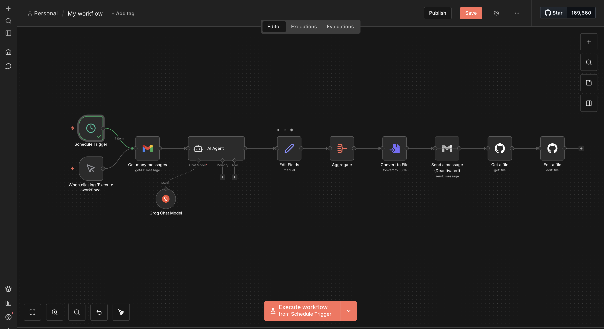

# 📨 Mon Agent Email Intelligent (AI-Powered Daily Digest)

Ce projet est une application complète qui automatise la lecture de mes emails, utilise l'Intelligence Artificielle pour les résumer, et affiche le résultat sur une interface web mise à jour quotidiennement.


---

## 📸 Aperçu du Workflow n8n

Voici à quoi ressemble le cerveau de l'automatisation. Le workflow part de la récupération des emails jusqu'au commit sur GitHub.



*(Si l'image ne s'affiche pas, place une capture d'écran nommée `workflow-n8n.png` à la racine du projet)*

---

## 🏗 Architecture & Logique

Le projet connecte plusieurs technologies pour fonctionner de manière autonome :

1.  **Source :** Gmail (Réception des messages).
2.  **Cerveau (Backend) :** **n8n**. Il orchestre tout le processus, discute avec l'IA et formate les données.
3.  **Stockage :** **GitHub**. Le fichier JSON sert de base de données.
4.  **Frontend :** **React (Vite)**. Une interface moderne pour lire les résumés.
5.  **Déploiement :** **GitHub Pages**. Hébergement gratuit et mise à jour automatique.

---

## 💡 Le Défi Technique : Pourquoi GitHub et pas mon Disque Dur ?

### Le problème rencontré sur macOS
Au début du développement, l'objectif était simple : faire en sorte que n8n écrive directement le fichier `mes_emails.json` sur le disque dur de mon Mac (`/Users/Oumar/...`), pour que le site React le lise immédiatement.

Nous avons rencontré plusieurs obstacles majeurs :
* **Permissions & Sandbox :** Les navigateurs modernes et les outils d'automatisation comme n8n tournent souvent dans des environnements isolés (Sandbox) pour la sécurité. Accéder au système de fichiers local crée des conflits de permissions (`EACCES`).
* **Conflits de fichiers :** Avoir un processus (n8n) qui écrit un fichier pendant qu'un autre processus (Vite/React) essaie de le lire provoque des erreurs de compilation et des plantages.
* **Limitations locales :** Cette méthode empêchait de consulter le site depuis un téléphone ou en dehors de la maison.

### La solution : "GitHub comme Base de Données"
Pour contourner ces problèmes, nous avons adopté une approche Cloud-Native :
1.  n8n ne touche pas au disque dur du Mac.
2.  Il utilise l'API de GitHub pour "pousser" (commit) la nouvelle version du fichier JSON.
3.  Cela déclenche une **GitHub Action** qui reconstruit le site et le met en ligne.

**Avantage :** Le système est robuste, accessible partout, et l'historique des emails est sauvegardé grâce à Git.

---

## 🚀 Guide de Démarrage (Commandes Indispensables)

Voici les commandes à utiliser pour relancer le projet après un redémarrage ou une pause.

### 1. Pour travailler sur le site (Frontend)
Si tu veux modifier le design ou le code React.

```bash
# 1. Aller dans le dossier du projet
cd ~/mon-agent-email

# 2. IMPORTANT : Récupérer les derniers emails générés par n8n (Synchronisation)
git pull

# 3. Aller dans le dossier de l'interface
cd web-interface

# 4. Lancer le serveur de développement
npm run dev