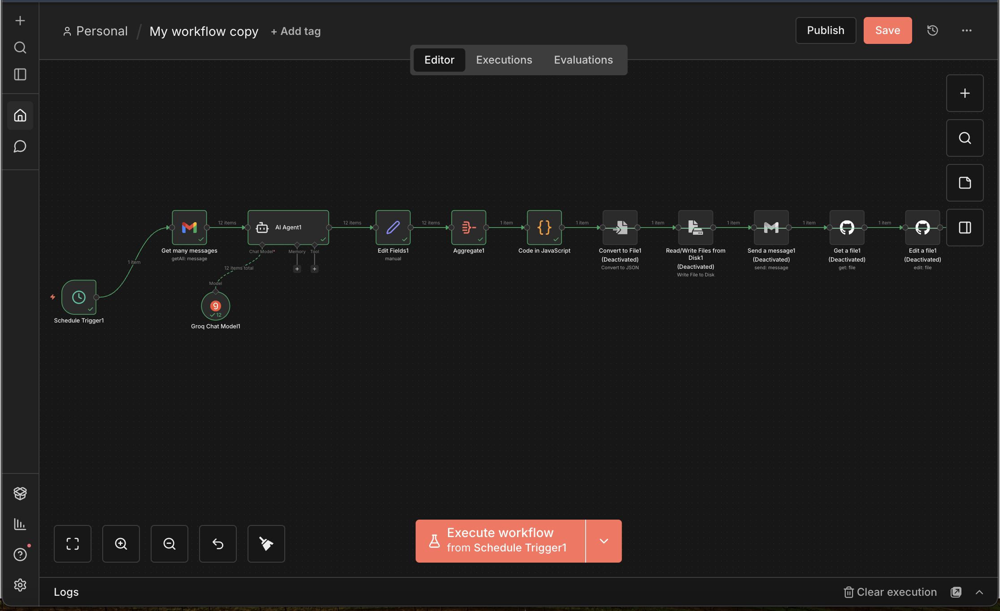

# 📨 Mon Agent Email Intelligent (AI-Powered Daily Digest)

Ce projet est une application complète qui automatise la lecture de mes emails, utilise l'Intelligence Artificielle pour les résumer, et affiche le résultat sur une interface web mise à jour quotidiennement.


---

## 📸 Aperçu du Workflow n8n

Voici à quoi ressemble le cerveau de l'automatisation. Le workflow part de la récupération des messages Gmail, les traite via l'IA, et génère le fichier de données pour le site.



---

## 🏗 Architecture & Logique

Le projet connecte plusieurs technologies pour fonctionner de manière autonome en local :

1.  **Source :** Gmail (Réception des messages).
2.  **Cerveau (Backend) :** **n8n**. Il orchestre tout le processus, discute avec l'IA et formate les données.
3.  **Stockage :** **Fichier JSON Local**. Les données sont écrites directement dans le dossier du site (`web-interface/public/mes_emails.json`).
4.  **Frontend :** **React (Vite)**. Une interface moderne qui lit ce fichier JSON local pour afficher les résumés.

---

## 🔥 Le Défi Technique : n8n et les Permissions macOS

L'un des plus gros obstacles de ce projet a été l'écriture automatique du fichier de données (`mes_emails.json`) sur le disque dur du Mac.

### Le problème avec les nœuds standards n8n
Initialement, j'ai tenté d'utiliser les nœuds classiques proposés par n8n pour l'écriture de fichiers :
* ❌ **"Read/Write Files from Disk"**
* ❌ **"Write Binary File"**

Sur macOS, ces nœuds rencontrent souvent des problèmes de permissions stricts (erreurs `EACCES` ou "not writable"), car n8n tourne dans un environnement sécurisé qui a du mal à accéder aux dossiers utilisateurs standards comme le Bureau ou les Documents.

### ✅ La Solution : Le Nœud "Code" (JavaScript)
Pour contourner ces blocages, j'ai remplacé les nœuds de fichiers par un nœud **Code** personnalisé.

Au lieu de passer par l'abstraction de n8n, j'utilise directement le module `fs` (File System) de Node.js via ce script :

```javascript
const fs = require('fs');
// Chemin absolu vers le dossier public du site React
const path = '/Users/oumarsang/mon-agent-email/web-interface/public/mes_emails.json';
// Écriture directe (bypass des sécurités n8n standards)
fs.writeFileSync(path, JSON.stringify($input.all().map(i => i.json), null, 2));
return [{ json: { success: true } }];